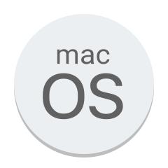

### Hi, I'm Sergio :technologist: :man_scientist: 👋

<!--
**SergioBaldo/SergioBaldo** is a ✨ _special_ ✨ repository because its `README.md` (this file) appears on your GitHub profile.

Here are some ideas to get you started:

-->

- 🔭 I’m currently working on ...
- 🌱 I’m currently learning ...
- 👯 I’m looking to collaborate on ...
- 🤔 I’m looking for help with ...
- 💬 Ask me about ...
- 📫 How to reach me: ...
- 😄 Pronouns: ...
- ⚡ Fun fact: ...

### Who am I?
* :technologist: Data Scientist in Development
* :man_scientist: Researcher
* :gear: Technical Degree in Mechatronics
* :man_student: Bachelor of Biomedica Informatics - USP

### I am interested in:
* :brain: Neuroscience
* :desktop_computer: Machine Learning
* :electron: Artificial Neural Networks
* :dna: Genetic Algorithm

### Find me around the world :earth_americas:

[][linkedin]
[][instagram]
[][twitter]

### Languages and Tools:

[linkedin]: https://www.linkedin.com/in/sergiobaldo/
[twitter]: https://twitter.com/SergioBaldo1
[instagram]: https://www.instagram.com/sergiobaldo_/

